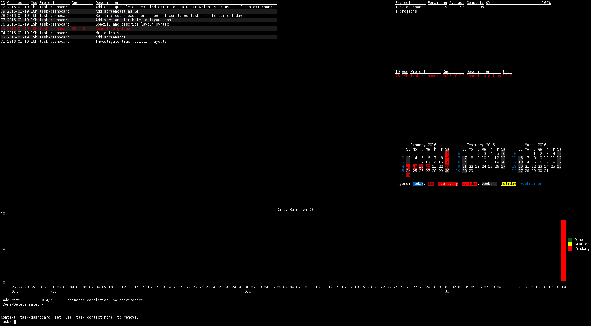

task-dashboard
==============

A tmux based dashboard for taskwarrior.




Setup
-----

1.	Clone repository
	```
	git clone https://github.com/8ware/task-dashboard.git
	```
2.	Copy sample configuration file to its expected location
	```
	cp doc/sample-config.json ~/.task/dashboard.json
	```
	*If the task shell is not available the last command must be adjusted!*
3.	Start dashboard (preferably maximized)
	```
	urxvt -e $PWD/task-dashboard &
	```


Layout Configuration
--------------------

The configuration of the layout is closely tied to tmux' behavior of splitting
windows. Thus the target pane and execution order does matter. The layout is
constructed splitting a *pivot* pane (i.e. the pane which would be focussed if
splitting manually).

The layout configuration consists of a key which is the *layout specification*
and an array of *commands* as its value. Instead of a command another nested
layout can be specified which allows to create more complex setups. The keys
have the following structure:
```
{h|v}:(~|pN|lN)[:...]
```
Such a layout specification consists of a split direction, i.e. `h` or `v` as
used with the tmux' `split-window` command (`h` for a vertical and `v` for a
horizontal split), *one* pivot pane indicator (`~`) and one or more split
directives, e.g. percentage (`p33` for a pane ratio of 2:1) or lines (`l2` for
creating a pane with just two lines height). For example, the layout
`v:l2:~:p33` will result in tree panes which are split horizontally where the
top pane is two lines high, the bottom pane is approx. one third of the window
height (i.e. a third of the window's height minus the two previously split
lines) and the middle pane fills the rest of the space (since it is the pivot
pane).

When constructing an own layout the split order has to be taken into account.
Internally the list of split directives is processed in the following order:
1. all directives before the pivot pane indicator split above
2. all directives after the pivot pane indicator split below *in reverse order*
Consider the following directives: `v:~:p50:p33`. This will split the pane into
three equally sized panes. First, the pane is split with a 2:1 ratio, then the
pane is split again with a 1:1 ratio resulting in 1:1:1.

See the [example configuration](doc/sample-config.json) file for a more complex example.

**WARNING:** If you don't pay attention to always include the `rc.hooks:off`
option in task commands (use `rc.verbose:hook` to avoid unnecessary output) you
easily create a *fork bomb* (because using task commands invokes the hook which
updates the view again).

### Markers

Markers are used to annotate commands to indicate special handling for them.
Currently two markers are supported: the focus marker (`*`) and the no-update
marker (`!`). The former can be used to focus a certain pane after layouting
has been finished; the latter will prevent execution of that command when
updating the views (e.g. when running task shell in one pane).

*Note, that the order of the marker matters (for now):* 
*	`*!` ... valid
*	`!*` ... invalid

---
Any improvements, especially regarding more intuitive ways of describing the
layout, are appreciated.

